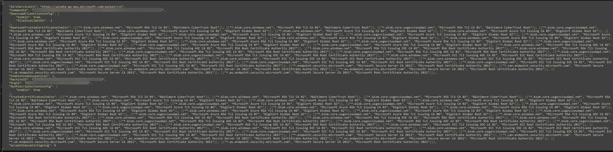

# Defender for Endpoint (MDE)

Defender for Endpoint has a Live Response feature that allows users to connect remotely to an endpoint and drop in a shell supported multiple commands. Through the use of the "Library", it is possible for a user to upload and execute an arbitrary PowerShell script on a Windows endpoint. It is also possible for a user to upload a file to an endpoint and execute that file through a PowerShell script (e.g.: a Velociraptor collector, Autoruns, a remediation tool, etc.).

When a file is uploaded from the Library to the Windows endpoint, the file is dropped in the following folder:
```
C:\ProgramData\Microsoft\Windows Defender Advanced Threat Protection\Downloads
```
For instance, uploading a file named "Velociraptor_Collector.exe" to the Library and uploading it to the endpoint would result in this file being created at:
```
C:\ProgramData\Microsoft\Windows Defender Advanced Threat Protection\Downloads\Velociraptor_Collector.exe
```
On the other hand, on a Linux endpoint, the file is dropped in the following folder:
```
/var/opr/microsoft/mdatp/response/
```
Which would look like this, if we uploaded a file named "getNetworkConnections.sh":
```
/var/opt/microsoft/mdatp/response/getNetworkConnections.sh
```
## 1. Network Telemetry

Too many domains and/or URLs to list. Microsoft has a comprehensive list of domains/URLs that endpoints where Defender for Endpoint is deployed need to access.

https://learn.microsoft.com/en-us/microsoft-365/security/defender-endpoint/configure-environment?view=o365-worldwide

## 2. Windows

### 2.1 Process Ancestry

The process ancestry for Defender for Endpoint depends on what the uploaded and executed PowerShell script does on the endpoint. Will it call external processes/binaries, or is it pure inline PowerShell (e.g.: cmdlet). In both situations, the main "process commandline" that interest us is the same. However, in situations where the script calls external processes/binaries, that "main" process will become the parent process in your queries/search.
```
[For a PowerShell script that call any external processes/binaries]
Grandparent Process Path - C:\Program Files\Windows Defender Advanced Threat Protection\SenseIR.exe
Grandparent Process CommandLine - "C:\Program Files\Windows Defender Advanced Threat Protection\SenseIR.exe" "OnlineSenseIR" "{0-9}[4]" $ENCODED_POWERSHELL_COMMAND

Parent Process Path - C:\Windows\System32\WindowsPowerShell\v1.0\powershell.exe
Parent Process CommandLine - C:\WINDOWS\system32\WindowsPowerShell\v1.0\powershell.exe -ExecutionPolicy Bypass -NoProfile -NonInteractive -Command "& {$OutputEncoding = [Console]::OutputEncoding =[System.Text.Encoding]::UTF8;$scriptFileStream = [System.IO.File]::Open('C:\ProgramData\Microsoft\Windows Defender Advanced Threat Protection\Downloads\PSScript_{$CLSID}.ps1', [System.IO.FileMode]::Open, [System.IO.FileAccess]::Read, [System.IO.FileShare]::Read);$calculatedHash = Microsoft.PowerShell.Utility\Get-FileHash 'C:\ProgramData\Microsoft\Windows Defender Advanced Threat Protection\Downloads\PSScript_{$CLSID}.ps1' -Algorithm SHA256;if (!($calculatedHash.Hash -eq '$POWERSHELL_SCRIPT_HASH')) { exit 323;};Start-Transcript -Path 'C:\ProgramData\Microsoft\Windows Defender Advanced Threat Protection\Temp\PSScriptOutputs\PSScript_Transcript_{$CLSID}.txt'; . 'C:\ProgramData\Microsoft\Windows Defender Advanced Threat Protection\Downloads\PSScript_{$CLSID}.ps1' }"

Process Path - *user input dependent*
OR
Process Path (if the external process/binary was uploaded via the Library) - C:\ProgramData\Microsoft\Windows Defender Advanced Threat Protection\Downloads\$BINARY_NAME

[For a PowerShell script that does not call any external processes/binaries]
Parent Process Path - C:\Program Files\Windows Defender Advanced Threat Protection\SenseIR.exe
Parent Process CommandLine - "C:\Program Files\Windows Defender Advanced Threat Protection\SenseIR.exe" "OnlineSenseIR" "{0-9}[4]" $ENCODED_POWERSHELL_COMMAND

Process Path - C:\Windows\System32\WindowsPowerShell\v1.0\powershell.exe
Process Command Line - C:\WINDOWS\system32\WindowsPowerShell\v1.0\powershell.exe -ExecutionPolicy Bypass -NoProfile -NonInteractive -Command "& {$OutputEncoding = [Console]::OutputEncoding =[System.Text.Encoding]::UTF8;$scriptFileStream = [System.IO.File]::Open('C:\ProgramData\Microsoft\Windows Defender Advanced Threat Protection\Downloads\PSScript_{$CLSID}.ps1', [System.IO.FileMode]::Open, [System.IO.FileAccess]::Read, [System.IO.FileShare]::Read);$calculatedHash = Microsoft.PowerShell.Utility\Get-FileHash 'C:\ProgramData\Microsoft\Windows Defender Advanced Threat Protection\Downloads\PSScript_{$CLSID}.ps1' -Algorithm SHA256;if (!($calculatedHash.Hash -eq '$POWERSHELL_SCRIPT_HASH')) { exit 323;};Start-Transcript -Path 'C:\ProgramData\Microsoft\Windows Defender Advanced Threat Protection\Temp\PSScriptOutputs\PSScript_Transcript_{$CLSID}.txt'; . 'C:\ProgramData\Microsoft\Windows Defender Advanced Threat Protection\Downloads\PSScript_{$CLSID}.ps1' }"
```
For SenseIR.exe, $ENCODED_POWERSHELL_COMMAND is actually an encoded JSON string which contains various information such as: CommandId, MachineId, OrgId, AirsServiceUrl, parameters related to the script execution and also full certificate trust chains.



For PowerShell.exe, $CLSID refers to [TO DO]

For PowerShell.exe, $POWERSHELL_SCRIPT_HASH refers to [TO DO]

### 2.2 Host Artifacts

When a script is executed from Live Response, Defender for Endpoint will create a Transcript log on the endpoint at the following path:
```
C:\ProgramData\Microsoft\Windows Defender Advanced Threat Protection\Temp\PSScriptOutputs\PSScript_Transcript_{$CLSID}.txt
```
Where $CLSID is the [TO BE ADDED]

## 3. Linux

### 3.1. Process Ancestry

```
Grandparent Process Path - /opt/microsoft/mdatp/sbin/wdavdeamon
Grandparent Process CommandLine - /opt/microsoft/mdatp/sbin/wdavdeamon edr {0-9}[2] {0-9}[2] --log_level info

Parent Process Path - /opt/microsoft/mdatp/sbin/senseir
Parent Process CommandLine - /opt/microsoft/mdatp/sbin/senseir $BASE64_ENCODED_STRING

Process Path - /bin/bash
Process CommandLine - /bin/bash -s --

Child Process Path - *user input dependent*
Child Process CommandLine - *user input dependent*
```
For senseir, $BASE_ENCODED_STRING refers to [TO DO]

The Process Path, which is the Linux shell, may depend on which shell you choose to call/use in a script that is being executed from the Library.

In a similar fashion, the Child Process (or Processes) will depend on the binaries/executables that are called from the script.

## 4. References

https://learn.microsoft.com/en-us/microsoft-365/security/defender-endpoint/live-response?view=o365-worldwide
